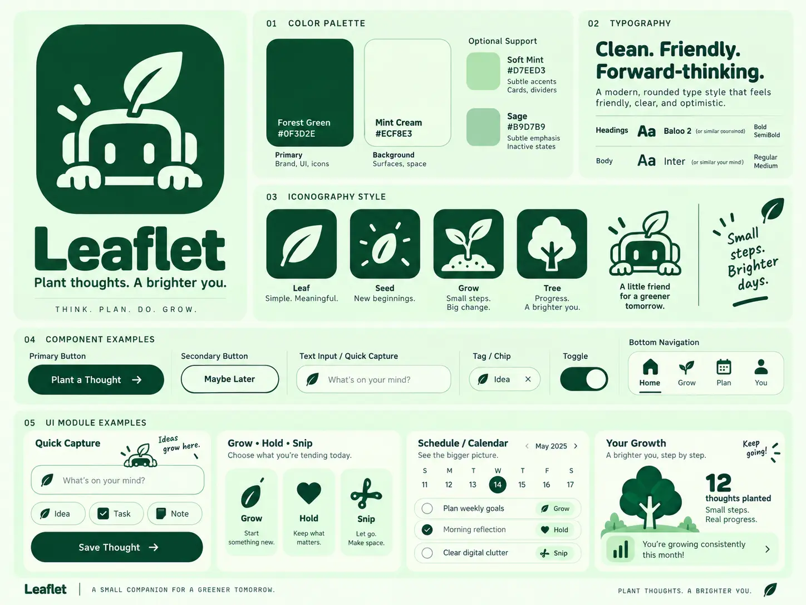

# Design constitution

## Canonical visual references

The following references establish Leaflet's current visual direction. They supersede the earlier pixel-art and scrap-metal character direction.

### Brand and interface direction

This board is authoritative for the palette, friendly rounded character, organic visual language, typography direction, generous spacing, and low-clutter component styling. The example labels, navigation, slogans, dates, metrics, and feature names are illustrative; they do not independently define product behavior or information architecture.

### App icon direction

This image is the canonical app-icon concept. Production exports may be optically adjusted for platform masks and small sizes, but must preserve the recognizable sprouting character, rounded-square field, and two-color silhouette.

When an image conflicts with explicit written product behavior, accessibility requirements, or a later recorded decision, the written requirement or later decision takes precedence. Update the reference instead of allowing the implementation and documentation to drift indefinitely.

## Brand character

Leaflet should feel clean, friendly, calm, organic, optimistic, and personal. It is a small companion for thinking and growth, not an enterprise dashboard or a generic AI assistant.

Green is the dominant identity color. Growth imagery should feel encouraging and grounded rather than childish, clinical, or productivity-obsessed.

## Visual system

### Color

| Token | Value | Intended use |
|---|---:|---|
| Forest Green | `#0F3D2E` | Primary brand color, text, controls, and icons |
| Mint Cream | `#ECF8E3` | Primary background and quiet surfaces |
| Soft Mint | `#D7EED3` | Cards, dividers, and subtle accents |
| Sage | `#B9D7B9` | Inactive and secondary emphasis |

Forest Green and Mint Cream form the core high-contrast pairing. Soft Mint and Sage are supporting colors, not default body-text colors. Any implementation must verify contrast in context and must not communicate state through color alone.

### Typography

- Prefer **Baloo 2** for expressive headings and brand moments.
- Prefer **Inter** for body text, labels, controls, and dense interface content.
- Use rounded typography selectively; readability and hierarchy take precedence over personality.
- Keep weights restrained and avoid filling screens with oversized display text.

If either typeface is unavailable during initial scaffolding, use a documented rounded display fallback and a neutral system sans-serif without changing the intended hierarchy.

### Shape, depth, and spacing

- Use rounded containers, pill-shaped primary controls, simple outlines, and generous breathing room.
- Favor light Mint Cream surfaces with Forest Green actions and text.
- Keep borders and shadows subtle; depth should separate layers without making the interface glossy or heavy.
- Preserve clear grouping and alignment. Organic does not mean irregular or imprecise.

### Iconography and illustration

- Use simple, meaningful leaf, seed, sprout, and tree forms where they clarify an action or state.
- Keep silhouettes bold enough to remain legible at small sizes.
- Use one coherent family of filled or outlined icons within a view; do not mix visual weights arbitrarily.
- Decorative hand-drawn accents may add warmth in sparse moments, but they must not compete with controls or essential information.

## Interface principles

Prefer:

- progressive disclosure;
- direct manipulation;
- clear hierarchy and generous breathing room;
- spatial relationships that reveal connections;
- a small number of meaningful controls;
- animation that explains state, direction, or life;
- consistent patterns across thoughts, goals, tasks, events, and conversations;
- mobile behavior designed intentionally, not treated as a compressed desktop screen.

Avoid:

- dashboard overload;
- excessive cards, tabs, colors, borders, and permanent controls;
- purple-gradient generic AI/SaaS styling;
- redundant navigation or repeated information;
- animation that delays interaction or exists only as decoration;
- forcing the user to understand the underlying graph or AI architecture.

## Spatial model

Leaflet may visualize a person's world as branches, a graph, or simple topics in a pannable space. The metaphor must clarify relationships, not create visual clutter. Journal, goals, and calendar are views into the same underlying world rather than disconnected mini-apps.

The sample bottom navigation and module arrangement in the brand board are not a locked navigation decision. Information architecture must be chosen from verified user flows and recorded separately.

## Leaflet mark and companion

The current companion direction is:

- a simplified, rounded character peeking over a surface;
- a living leaf sprouting from the top of its head;
- minimal facial features that remain warm and recognizable at small sizes;
- a bold cream-on-Forest-Green silhouette for the app icon;
- smooth, clean geometry with restrained soft depth;
- expressive variations that preserve the core silhouette and visual simplicity.

The earlier pixel-art, dirtied scrap-metal, exposed-bolt, green-screen-face, and forehead-crack details are no longer part of the canonical direction.

## Voice in the interface

Copy should be brief, warm, and encouraging without becoming vague or overly cute. Growth language may support the experience, but ordinary actions must remain understandable without decoding a metaphor. The slogans and microcopy shown in the reference board are directional examples, not mandatory strings.

## Motion

Motion may make the character and growth metaphor feel alive through small, calm responses such as a gentle leaf sway or brief acknowledgement. It should explain state or reward meaningful progress, respect reduced-motion preferences, and never delay capture or navigation.

## Interaction states

Every meaningful interface must consider loading, empty, error, success, offline/retry where relevant, keyboard use, focus state, reduced motion, and narrow mobile layouts.

Accessibility is part of the design, not a final polish pass. Do not rely on color alone; maintain readable contrast, semantic structure, target sizes, and visible focus.

## Design review questions

- Does this reduce effort or add another organizational ritual?
- Is the primary action obvious without explanation?
- Can any element be removed without losing meaning?
- Is the relationship among concepts clearer after the interaction?
- Does the result match the canonical references without copying illustrative placeholder behavior?
- Does Leaflet feel warm and personal rather than corporate?
- Are motion and character behavior purposeful and accessible?
